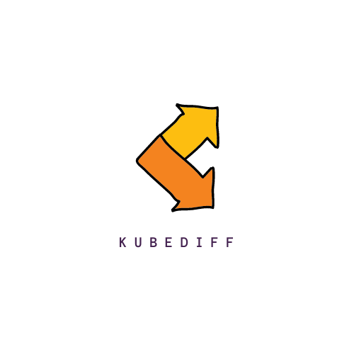

<p align="center">
  
</p>

# kubediff

**kubediff** is a Kubernetes resource diff watcher, with the ability to send event notifications.

[](https://asciinema.org/a/6Hi2rnrJFjrfdG8SpNE7wy9m7)

# Usage
```
$ kubediff --config=/path/to/config

kubediff: A resource diff watcher for Kubernetes

kubediff is a Kubernetes resource diff watcher with the ability to configure event notifications
to webhook/Slack. It watches the cluster for any resource change (including custom CRDs) and logs them. You can also run it in normal mode, and can export the logs to your preferred logging stack.

Usage:
  kubediff --config=/path/to/config

Flags:
  --config   configuration folder for kubediff

```

# Install

#### Using helm:

When you have helm installed in your cluster, use the following setup:

```console
helm repo add arriqaaq https://arriqaaq.github.io/charts
helm repo update
helm install --create-namespace --namespace kubediff kubediff arriqaaq/kubediff
```

You can also install this chart locally by cloning this repo:

```console
helm install --create-namespace --namespace kubediff kubediff helm/kubediff
```


#### Using kubectl:

In order to run kubediff in a kind cluster quickly, just run

```console
$ kubectl apply -f hack/deploy.yaml
```


#### Configuration:
You can also provide a custom config file:

```yaml
resources:
  - kind: v1/pods             # Name of the resource. Resource name must be in group/version/resource (G/V/R) format
                              # resource name should be plural (e.g apps/v1/deployments, v1/pods)
  - kind: v1/services
  - kind: apps/v1/deployments
  - kind: apps/v1/statefulsets
  - kind: networking.k8s.io/v1beta1/ingresses
  - kind: v1/nodes
  - kind: v1/namespaces
  - kind: v1/persistentvolumes
  - kind: v1/persistentvolumeclaims
  - kind: v1/configmaps
  - kind: apps/v1/daemonsets
  - kind: batch/v1/jobs
  - kind: rbac.authorization.k8s.io/v1/roles
  - kind: rbac.authorization.k8s.io/v1/rolebindings
  - kind: rbac.authorization.k8s.io/v1/clusterrolebindings
  - kind: rbac.authorization.k8s.io/v1/clusterroles

# watch multiple namespaces (or use **all** to watch all namespaces) 
namespaces:
  - all
```


#### Using Go:

```console
# Download and install kubediff
$ go get -u github.com/arriqaaq/kubediff

# Add resources to be watched
kubediff --config=./test/

```

# Resources

Read more on how it is implemented (here)[https://aly.arriqaaq.com/kubernetes-informers/]
